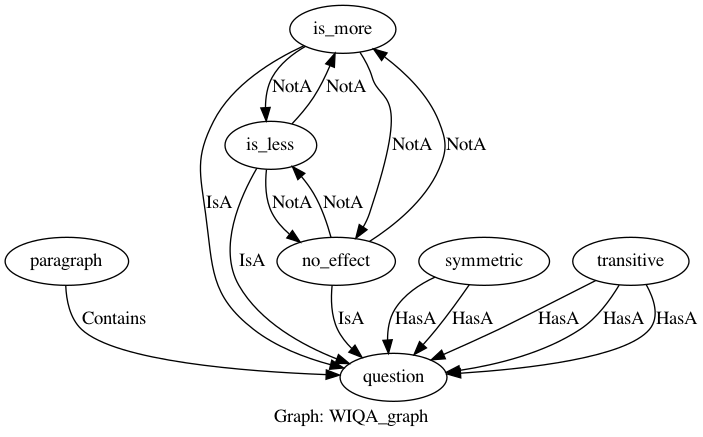

# Pipeline

The following are the user's steps to using our framework.

- [Pipeline](#pipeline)
  - [1. Knowledge Declaration](#1-knowledge-declaration)
  - [2. Model Declaration](#2-model-declaration)
  - [3. Training and Testing](#3-training-and-testing)
  - [4. Inference](#4-inference)
  - [5. Takeaway](#5-takeaway)

## 1. Knowledge Declaration

Class reference:

- `domiknows.graph.Graph`
- `domiknows.graph.Concept`
- `domiknows.graph.Property`
- `domiknows.graph.Relation`
- `domiknows.graph.LogicalConstrain`
- `domiknows.graph.Datanode`

In knowledge declaration, the user defines a collection of concepts and the way they are related to each other, representing the domain knowledge for a task.
We provide a graph language based on python for knowledge declaration with the notation of `Graph`, `Concept`, `Property`, `Relation`, and `LogicalConstrain`.

The output of the Knowledge Declaration step is a `Graph`, within which there are `Concept`s, `Relation`s, and `LogicalConstrain`s. `Graph` instances are a basic container of the `Concept`s, `Relation`s, `LogicalConstrain`s and other instances in the framework. The `Graph` is a *"partial program"*, and there is no behavior associated. It is only a data structure to express domain knowledge.


Follows is an example showing how to declare a graph. in this example, we have a paragraph, each paragraph has some questions related to it and the answer to each question can be "more", "less" and "no effect".

```python
with Graph('WIQA_graph') as graph:

    paragraph = Concept(name='paragraph')
    question = Concept(name='question')
    para_quest_contains, = paragraph.contains(question)

    is_more = question(name='is_more')
    is_less = question(name='is_less')
    no_effect = question(name='no_effect')

    symmetric = Concept(name='symmetric')
    s_arg1, s_arg2 = symmetric.has_a(arg1=question, arg2=question)

    transitive = Concept(name='transitive')
    t_arg1, t_arg2, t_arg3 = transitive.has_a(arg11=question, arg22=question, arg33=question)
    ...

```

The above code shows the declaration of a `Graph` named `'WIQA_graph'` as variable `graph`.

first, we define paragraph, then we define questions and add a contains relation from paragraph to question

In the graph, there are `Concepts`s named `'paragraph'`, `'question'`, `'symmetric'` and `'transitive'` as python variables with the same name. 
`symmetric` has two arguments named `arg1` and `arg2`, which are both `question`.
`transitive` on the other hand has three arguments named `arg11`, `arg22` and `arg33`, all of which are `question` as well.
`is_more` , `is_less` and `no_effect` are concepts that have IsA relation with `question`. we will use these three concepts as labels of questions as the answer to these questions can be one of these three.

further, in the graph, we define our constraints.

```python
with Graph('WIQA_graph') as graph:
    ...
    disjoint(is_more, is_less, no_effect)
    orL(is_more, is_less, no_effect)
    
    ifL(is_more('x'), is_less('y', path=('x', symmetric.name, s_arg2.name)))
    ifL(is_less('x'), is_more('y', path=('x', symmetric.name, s_arg2.name)))

    ifL(andL(is_more('x'), is_more('z', path=('x', transitive.name, t_arg2.name))),
        is_more('y', path=('x', transitive.name, t_arg3.name)))

    ifL(andL(is_more('x'), is_less('z', path=('x', transitive.name, t_arg2.name))),
        is_less('y', path=('x', transitive.name, t_arg3.name)))
```

some constraints are inherent in the graph such as the relations that are defined in them. but other constraints must be defined explicitly. 
the first constraint is the `disjoint` constraint between `is_more` , `is_less` and `no_effect`. disjoint means that at most one of these labels can be True at the same time. in the next line, we add `orL` among our labels to make sure at least one of them is correct as well.

further, we define the symmetric and transitive constraints. 

the symmetric relation is between questions that are opposite of each other and have opposing values. we define that if a question is `is_more` or `is_less` and it has asymmetric relation with another question, then the second question should be `is_less` and `is_more` respectively.

the transitive relation is between questions that have a transitive relation between them meaning that the effect of the first question is the cause of the second question and the third question is made of the cause of the first and the effect of the second question. the transitive relation implies that if the first and the second question are `is_more`, so should be the third question. but if the first question is `is_more` and the second question is `is_less`, then the third question should also be `is_less`

The following figure illustrates the graph for this task:


See [here](developer/KNOWLEDGE.md) for more details about declaring graph and constraints.


## 2. Model Declaration

Class reference:

- `domiknows.data.reader.RegrReader`
- `domiknows.sensor.Sensor`
- `domiknows.sensor.Learner`
- `domiknows.program.Program`

In the model declaration, the user defines how external resources (raw data), external procedures (preprocessing), and trainable deep learning modules are associated with the concepts and properties in the graph.
We use `Reader`s, `Sensor`s, and `Learner`s accordingly for the model declaration to create a *"full program"* as `Program`.

To create a program, the user needs to first assign `Sensor`s and `Learner`s to `Property`s of `Concept`s in the graph. Then initiate a `Program` with the graph.

There are different [pre-defined sensors](./apis/sensor/PYTORCH.md) for basic data operation with PyTorch. Users can also extend [base `Sensor`](./apis/SENSORS.md) to customize for their task [by overriding `forward()` method](developer/MODEL.md#overriding-forward).

```python
paragraph['paragraph_intext'] = ReaderSensor(keyword='paragraph_intext')
paragraph['question_list'] = ReaderSensor(keyword='question_list')
paragraph['less_list'] = ReaderSensor(keyword='less_list')
paragraph['more_list'] = ReaderSensor(keyword='more_list')
paragraph['no_effect_list'] = ReaderSensor(keyword='no_effect_list')
paragraph['quest_ids'] = ReaderSensor(keyword='quest_ids')

```

In the example above, the first `ReaderSensor` is assigned to the property `'paragraph_intext'`.
is the following reader sensors, a list of concatenated properties are read from the reader and later through other sensors are given to individual questions.

```python
question[para_quest_contains, "question_paragraph", 'text', "is_more_", "is_less_", "no_effect_", "quest_id"] = JointSensor(
    paragraph['paragraph_intext'], paragraph['question_list'], paragraph['less_list'], paragraph['more_list'],
    paragraph['no_effect_list'], paragraph['quest_ids'],forward=make_questions)
```

A joint sensor is a sensor that outputs multiple properties. here it calculates `para_quest_contains`, `"question_paragraph"`, `'text'`, `"is_more_"`, `"is_less_"`, `"no_effect_"`and `"quest_id"` properties for a question while taking multiple properties of a paragraph. the forward function make_questions takes one instance of a paragraph with its properties in the input and the output, it returns seven lists of questions properties.
the first property `para_quest_contains` is the Containts relation between a paragraph and the questions from the definition of graph earlier and its list is equal to a torch of ones of the shape ( length of questions for a paragraph, 1). this encoding implies that a paragraph contains its questions. the length of questions can be different for different paragraphs.
the rest of the lists are lists of the properties of questions in a list of length equal to the number of questions.

```python
question["token_ids", "Mask"] = JointSensor( "question_paragraph", 'text',forward=RobertaTokenizer())
```
in another joint sensor here we take `question_paragraph` and `text` properties of a question, which are the text of its related paragraph and its own text respectively, feed it to a Roberta tokenizer and as output, we get `token_ids` and `Mask` properties of the question. unlike the previous joint sensor, here the input is a list not a single instance. the reason for that is the internal dynamics of DomiKnows. when questions were created they were created in a list and that's how they can be accessed in sensors. however, later during inference, they can be accessed individually. as a result, the output should also be two lists of the desired properties equal to the size of the input questions.


```python
question[is_more] = FunctionalSensor("is_more_", forward=label_reader, label=True)
question[is_less] = FunctionalSensor("is_less_", forward=label_reader, label=True)
question[no_effect] = FunctionalSensor("no_effect_", forward=label_reader, label=True)
```

the properties that we want to train our program on must be calculated in a sensor with `label=True`. joint sensor deals with multiple properties. so instead we use a functional sensor, which here takes the `is_more_`, `is_less_` and `no_effect_` properties of questions and with the function, `label_reader` returns them exactly as they are ( in a list) but with `label=True` in the sensor. the `is_more`, `is_less`, and `no_effect` properties here are also not a string but the variable assigned to these concepts in our graph. so we can calculate these properties here and also define constraints on them in the graph.

`Learner`s, are similar to `Sensor`s. The only difference is that `Learner`s have trainable parameters. The `Program` will update the parameters in `Learner`s based on model performance. we can assign `Learner`s to `Property`s of `Concept`s. `ModuleLearner` is specifically useful to plugin PyTorch modules.


```python
question["robert_emb"] = ModuleLearner("token_ids", "Mask", module=roberta_model)
question[is_more] = ModuleLearner("robert_emb", module=RobertaClassificationHead(roberta_model.last_layer_size))
question[is_less] = ModuleLearner("robert_emb", module=RobertaClassificationHead(roberta_model.last_layer_size))
question[no_effect] = ModuleLearner("robert_emb", module=RobertaClassificationHead(roberta_model.last_layer_size))
```

`ModuleLearner` in the above code is used first to calculate an embedding for a question given its `token_ids` and `Mask` properties. being a Learner, this sensor's parameters will change and update itself during training later. in the following three lines, this `embedding` property is used to calculate the binary labels for `is_more`, `is_less`, and `no_effect`. these learners will also learn from predictions after calculating loss given the actual values of these properties.

It should be noted that we have assigned `ReaderSensor`s to the same `Property`s of `is_more`, `is_less`, and `no_effect`.
This is the ["Multiple Assignment" semantic](MODEL.md#multiple-assigment-convention) of the framework.
Instead of overwriting the assignment, "Multiple Assignment" indicates the consistency of the `Sensor`s and `Learner`s assigned to a single `Property`.

we should also define the sensors for symmetric and transitive concepts. these concepts have arguments and their definition is a little different from previous sensors. for these concepts, we use Edge Sensors.

```python
symmetric[s_arg1.reversed, s_arg2.reversed] = CompositionCandidateSensor(question['quest_id'],relations=(s_arg1.reversed, s_arg2.reversed),forward=guess_pair)
transitive[t_arg1.reversed, t_arg2.reversed, t_arg3.reversed] = CompositionCandidateSensor(question['quest_id'],relations=(t_arg1.reversed,t_arg2.reversed,t_arg3.reversed),forward=guess_triple)
```

`CompositionCandidateSensor` is an Edge sensor that takes two questions ( `quest_id` property of them is this case) and returns True or False determining whether or not they have symmetric relation. `CompositionCandidateSensor` is an Edge sensor that creates the relation Tensors for us but these tensors can be defined and output manually.
the same process also goes for the transitive concept with the difference being the input that is three questions and their `quest_id`s.

Now that the `graph`, the `Property`s of `Concept`s are assigned with different types of `Sensor`s and `Learner`s, We can create a `Program` from the `graph`.

```python
program = LearningBasedProgram(graph, model_helper(primal_dual_model,poi=[question[is_less], question[is_more], question[no_effect],\
                                    symmetric, transitive],loss=MacroAverageTracker(NBCrossEntropyLoss()), metric=PRF1Tracker()))
```
the inputs to the `LearningBasedProgram` are first the conceptual graph that we defined earlier. next, the type of model that can be a simple poimodel, a model with IML loss, or a primal_dual model. [Here](./apis/program) is a list of different programs available for the uses. these models are different in how they use constraints to produce a loss. the simple poi model simply ignores these constraints. these constraints can later be used during inference and do not necessarily need to be used here. next to our model, we define poi that stands for "Properties of Interest". we add the final (leaf node) properties that we want the program to calculate here that in this case are the properties `is_more`, `is_less`, and `no_effect` of the question, and the symmetric and transitive concepts. the next inputs are the type of our loss function and the metric that we want to calculate for each epoch. one can find explanations about different `loss` function [here](../domiknows/program/loss.py), and explanations about different `metrics` [here](../domiknows/program/metric.py).

## 3. Training and Testing

With `Reader` and `Program` prepared by modeling step, the user can train the program now.
Simply do 

```python
program.train(reader, train_epoch_num=10, Optim=lambda param: AdamW(param, lr = args.learning_rate,eps = 1e-8 ), device='cuda:0')
print(program.model.loss)  # last training loss will be printed
print(program.model.metric)  # last training metrics will be printed
```

Here, `program` will check for "Multiple Assignment" of `Property` and generate a loss between each two `Sensor`s and/or `Learner`s where one has `label=True` and the other has `label=False`. The default total loss will be the sum of all "Multiple Assignment" losses, and optimization will be used with `Optim`. Parameters in direct and indirect `Learner`s will be updated towards a lower total loss.

After training, we can test our trained program with another dataset

```python
program.test(test_reader)
print(program.model.loss)  
print(program.model.metric)  
```

Checkout for more details about [workflows in the program](developer/WORKFLOW.md)

## 4. Inference

One feature of our framework is an automatic inference based on domain knowledge.
To try this out, the user must first create `Datanode`.

```python
for paragraph_ in program.populate(reader_test):
        paragraph_.inferILPResults(is_more)
        for question_ in paragraph_.getChildDataNodes():
            print(question_.getAttribute(is_more))
            print(question_.getAttribute(is_more, "ILP"))
```
`program.populate` given the reader, will create a datagraph of `Datanode`s and returns a list of "Root" concepts. the "Root" concept here is the `paragraph` concept. each `paragraph` is an instance of `Datanode` class. `paragraph_.inferILPResults(is_more)` tells the datagraph to calculates the "ILP" inference for the property `is_more`.

we can use `getChildDataNodes` method of a `paragraph` to access its questions. each `question` we can access this way, is also a `Datanode` class. one can use the `getAttribute` method of this `Datanode` to access the calculated result for its `is_more` property or as it is shown in the next line of the code, to access this property after "ILP" inference that enforces the constraints. here, unlike in sensors, the questions and their properties are accessed individually. we can use created datagraph here to do inference and calculate the metric with or without "ILP" however we wish.

Please find in a specific topic for more information about [how to query a `Datanode`](developer/QUERY.md) and [how inference works](developer/INFERENCE.md).

## 5. Takeaway

to see a full model at work visit the tutorial folder in the repository where the dynamics of a complete code are explained in jupyter.
