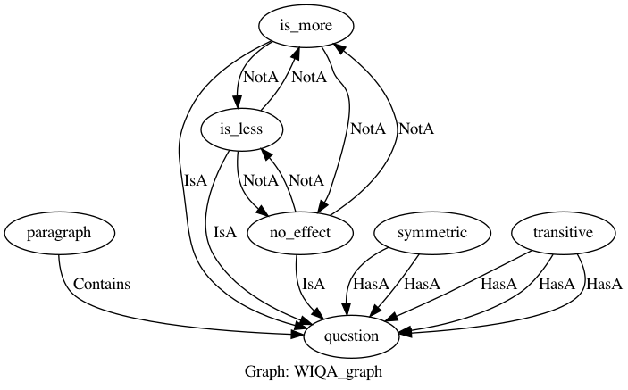

# Walkthrough Example

The followings are the user's steps to using our framework.

- Dataset
- **Knowledge Declaration**
- Model Declaration
- Training and Testing
- Inference

## Knowledge Declaration

In knowledge declaration, the user defines a collection of concepts and how they are related, representing the domain knowledge for a task.
We provide a graph language based on Python for knowledge declaration with the notation of `Graph`, `Concept`, `Property`, `Relation`, and `LogicalConstrain`.

The output of the Knowledge Declaration step is a `Graph`, within which there are `Concept`s, `Relation`s, and `LogicalConstrain`s. `Graph` instances are a basic container of the `Concept`s, `Relation`s, `LogicalConstrain`s and other instances in the framework. The `Graph` is a *"partial program"*, and no behavior is associated with it. It is only a data structure to express domain knowledge.


Follows is an example showing how to declare a graph. In this example, we have a paragraph, and each paragraph has some questions related to it and the answer to each question can be "more", "less" or "no effect".

```python
with Graph('WIQA_graph') as graph:

    paragraph = Concept(name='paragraph')
    question = Concept(name='question')
    para_quest_contains, = paragraph.contains(question)

    is_more = question(name='is_more')
    is_less = question(name='is_less')
    no_effect = question(name='no_effect')

    symmetric = Concept(name='symmetric')
    s_arg1, s_arg2 = symmetric.has_a(arg1=question, arg2=question)

    transitive = Concept(name='transitive')
    t_arg1, t_arg2, t_arg3 = transitive.has_a(arg11=question, arg22=question, arg33=question)
    ...

```

The above code shows the declaration of a `Graph` named `'WIQA_graph'` as a variable `graph`.

First, we define paragraph, then we define questions and add a contains relation from paragraph to question.

In the graph are `Concepts`s named `'paragraph'`, `'question'`, `'symmetric'` and `'transitive'` as Python variables with the same name. 
`symmetric` has two arguments named `arg1` and `arg2`, which are both `question`.
`transitive` on the other hand has three arguments named `arg11`, `arg22` and `arg33`, all of which are `question` as well.
`is_more` , `is_less` and `no_effect` are concepts that have IsA relation with `question`. We will use these three concepts as labels of questions as the answer to these questions can be one of these three.

Further, in the graph, we define our constraints.

```python
with Graph('WIQA_graph') as graph:
    ...
    disjoint(is_more, is_less, no_effect)
    orL(is_more, is_less, no_effect)
    
    ifL(is_more('x'), is_less('y', path=('x', symmetric.name, s_arg2.name)))
    ifL(is_less('x'), is_more('y', path=('x', symmetric.name, s_arg2.name)))

    ifL(andL(is_more('x'), is_more('z', path=('x', transitive.name, t_arg2.name))),
        is_more('y', path=('x', transitive.name, t_arg3.name)))

    ifL(andL(is_more('x'), is_less('z', path=('x', transitive.name, t_arg2.name))),
        is_less('y', path=('x', transitive.name, t_arg3.name)))
```

Some constraints are inherent in the graph, such as the relations that are defined in them. But other constraints must be defined explicitly. 
The first constraint is the `disjoint` constraint between `is_more` , `is_less` and `no_effect`. Disjoint means that at most one of these labels can be True simultaneously. In the following line, we add `orL` among our labels to ensure at least one of them is also correct.

Further, we define the symmetric and transitive constraints. 

The symmetric relation is between questions that are opposite and have opposing values. We define that if a question is `is_more` or `is_less` and has asymmetric relation with another question, the second question should be `is_less` and `is_more` respectively.

The transitive relation is between questions with a transitive relation, meaning that the effect of the first question is the cause of the second question and the third question is made of the cause of the first and the effect of the second question. The transitive relation implies that if the first and the second question are `is_more`, so should be the third question. But if the first question is `is_more` and the second question is `is_less`, then the third question should also be `is_less`.

The following figure illustrates the graph for this task:



See [here](https://github.com/HLR/DomiKnowS/blob/Doc/Main%20Components/Knowledge%20Declaration%20(Graph).md) for more details about declaring graph and constraints.

____
[Goto next section (Model Declaration)](Model%20Declaration.md)
