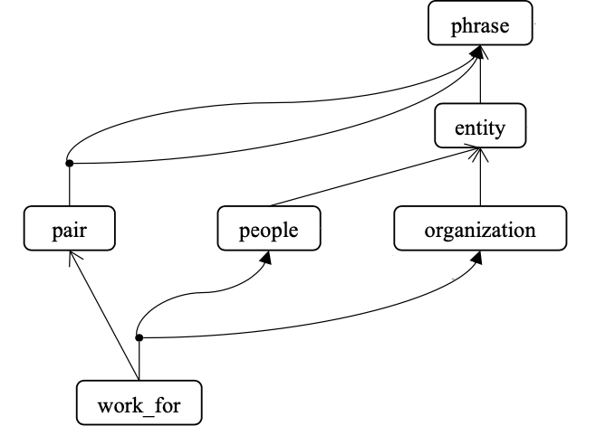

# Pipeline

The following is user's steps to using our framework.

- [Pipeline](#pipeline)
  - [1. Knowledge Declaration](#1-knowledge-declaration)
    - [1.1. Output](#11-output)
    - [1.2. Example](#12-example)
  - [2. Model Declaration](#2-model-declaration)
    - [2.1. Output](#21-output)
    - [2.2. Example](#22-example)
      - [2.2.1. `Reader` Example](#221-reader-example)
      - [2.2.2. `Program` Example](#222-program-example)
  - [3. Training and Testing](#3-training-and-testing)
  - [4. Inference](#4-inference)
  - [5. Takeaway](#5-takeaway)

## 1. Knowledge Declaration

Class reference:

- `regr.graph.Graph`
- `regr.graph.Concept`
- `regr.graph.Property`
- `regr.graph.Relation`
- `regr.graph.LogicalConstrain`
- `regr.graph.Datanode`

In knowledge declaration, the user defines a collection of concepts and the way they are related to each other, representing the domain knowledge a the task.
We provide a graph language based on python for knowledge declaration with notation of `Graph`, `Concept`, `Property`, `Relation`, and `LogicalConstrain`.

### 1.1. Output

The output of the Knowledge Declaration step is a `Graph`, within which there are `Concept`s, `Relation`s, and `LogicalConstrain`s. `Graph` instances are basic container of the `Concept`s, `Relation`s, `LogicalConstrain`s and other instances in the framework. The `Graph` is a *"partial program"*, and there is no behavior associated. It is only a data structure to express domain knowledge.

Notice that this graph, the *"conceptual graph"*, declare a data structure. When real data come, they will be populate based on the conceptual graph to generate `Datanode`s and the `Datanode`s will be connected and form a *"data graph"*.

### 1.2. Example

Follows is an example showing how to declare a graph.

```python
with Graph('global') as graph:
  sentence = Concept(name='sentence')
  word = Concept(name='word')
  (rel_sentence_contains_word,) = sentence.contains(word)
  pair = Concept(name='pair')
  (rel_pair_word1, rel_pair_word2) = pair.has_a(arg1=word, arg2=word)

  people = word(name='people')
  organization = word(name='organization')
  disjoint(people, organization)

  work_for = pair(name='work_for')
  work_for.has_a(people, organization)
```

The above snippet shows the declaration of a `Graph` named `'global'` as variable `graph`.
With in the graph, there are `Concept`s named `'sentence'`, `'word'`, and `'pair'` as python variable `sentence`, `word`, and `pair`. `sentence` contains `word`s. `pair` has two arguments named `arg1` and `arg2`, which are both `word`.
`people` and `organization` are inheritance `Concept` extended from `word`. That means `people` and `organization` are `word`s.
`people` and `organization` are disjoint, which means if an instance of `word` is `people`, it must not be an `organization`, and vice versa.
`work_for` extends `pair` by limiting the first argument (which was a `word` for `pair`) to be `people` and the first argument (which was also a `word` for `pair`) to be `organization`.

There are inheritance (relation `IsA` or logical `ifL()`), disjoint (relation `NotA`, or logical `nandL()`), and composition (relation `HasA` or a compositional logical expression) constraints implied in the above `graph`.
One can add more complex logical constraints with our logical expression notations.

See [here](developer/KNOWLEDGE.md) for more details about declaring graph and constraints.

The followig figure illustrate the graph for this task:


## 2. Model Declaration

Class reference:

- `regr.data.reader.RegrReader`
- `regr.sensor.Sensor`
- `regr.sensor.Learner`
- `regr.program.Program`

In model declaration, the user defines how external resources (raw data), external procedures (preprocessing), and trainable deep learning modules are associated with the concepts and properties in the graph.
We use `Reader`s, `Sensor`s, and `Learner`s accodingly for model declaration to create a *"full program"* as `Program`.

### 2.1. Output

One output of this phase is a `Reader` and a `Program`.

`Reader` are python `Iterable`s that yields a `dict` at a time. The `dict` instance is a data item (or a batch) that the model will be handling one time.
A `list` of `dict` is a simplest form of `Reader`.
However, users might want more flexible way to interact with data source and yield a data item. Implementing an `Iterable` would be a good option.
[This post](https://nvie.com/posts/iterators-vs-generators/) explain the role of `Iterable` in python, that might help one to understand what should be implemented.
The `Reader` will be used later when the full `Program` is created and a workflow that requires real data (e.g. `train(...)`) is invoked.

The `Program` is created from a `Graph` with `Sensor`s and `Learner`s attached.
`Sensor`s and `Learner`s are assigned to `Property`s associated with `Concept` in the `Graph`.

### 2.2. Example

#### 2.2.1. `Reader` Examples

An example of `Reader` as `list` of `dict`:

```python
reader = []
with open('data.txt', 'r') as fin:
  for line in fin:
    item = json.loads(line)
    reader.append(item)
```

In this example, reader is simply a `list` of items. Each item is a `dict` containing a single line loaded from `'data.txt'` as JSON object.

An example of `Reader` as `Iterable`:

```python
class Reader():
  def __init__(self, source):
    self.source=source

  def __iter__(self):
    with open(self.source, 'r') as fin:
      for line in fin:
        item = json.loads(line)
        yield item

reader = Reader('data.txt')
```

Please consult the [generator pattern](https://wiki.python.org/moin/Generators), [yield statement](https://docs.python.org/3/reference/expressions.html#grammar-token-yield-expression), and [this post](https://nvie.com/posts/iterators-vs-generators/) if you are not familiar with python `yield` and `Iterable`.

Being an `Iterable` that yields a `dict` at a time implies one can write a for loop with it

```python
for item in reader:
  # do something with `item`
  pass
```

Also, `torch.utils.data.DataLoader` is a good choice when working with PyTorch. Just remember to provide a `dict` at a time in the `dataset` to the `DataLoader`. `DataLoader` handles batch automatically with `collate_fn`, please consult [this section](https://pytorch.org/docs/stable/data.html#working-with-collate-fn) for more information if you run into issue with batching in `DataLoader`.

```python
dataset = []
with open('data.txt', 'r') as fin:
  for line in fin:
    item = json.loads(line)
    dataset.append(item)
  
reader = DataLoader(dataset)
```

The framework also has a simple reader `regr.data.reader.RegrReader`.

#### 2.2.2. `Program` Example

To create a program, user needs to first assign `Sensor`s and `Learner`s to `Property`s of `Concept`s in the graph. Then initiate a `Program` with the graph.

There are different [pre-defined sensors](./apis/sensor/PYTORCH.md) for basic data operation with PyTorch. Users can also extend [base `Sensor`](./apis/SENSORS.md) to customize for their task [by overriding `forward()` method](developer/MODEL.md#overriding-forward).

```python
SAMPLE = {
    'text': ['John works for IBM'],
    'peop': [1, 0, 0, 0],
    'org': [0, 0, 0, 1],
    'wf': [(0,3)]
}

reader = [SAMPLE]

sentence['text'] = ReaderSensor(keyword='text')

scw = sentence.relate_to(word)[0]
word[scw, 'text','ids','offset'] = JointSensor(sentence['text'], forward=tokenize)


word[people] = ReaderSensor(keyword='peop', label=True)
word[organization] = ReaderSensor(keyword='org', label=True)

word['emb'] = ModuleLearner('text', scw, module=WordEmbedding())
word[people] = ModuleLearner('emb', module=Classifier())
word[organization] = ModuleLearner('emb', module=Classifier())

```

In the example above, the first `ReaderSensor` is assigned to a special property `'text'`.
This `ReaderSensor` will simply read the key `'text'` from an sample, which is expected to be a `dict`, retrieved by enumerating through [the reader](#221-reader-example).
`Datanode` instance of concept `sentence` will be created based on the output of this sensor when being populated.
Next, a `JointSensor` is assigned uses the relation between sentence and word by sentence.relate_to(word)[0] to conect a sentence to its word nodes and assign them 'text','ids' and 'offset' features.
scw is the same relation as the realtion descrived in the graph 'sentence.contains(word)', so another way of getting it would have been (scw,)=sentence.contains(word). this relation contains sentence as its source feature 'src' and word as its destination feature 'dst'. so while we put this relation as the first feature of the jointSensor output, the sensor will convert sentence input to word output.
conversly, if we wanted to form a sentence from a group of words we would use 'scw.reversed'.

the input of the `JointSensor` is a sentence and the output should be a tuple for scw, 'text','ids' and 'offset' features in the form (scw, text,ids,offset). each of these output variables should be a tensor or a python list and their len or first dimention should be equal to the number of word. for instance scw could be 'torch.ones((number_of_words(sentence), 1))' and text could be a list of words. the framework will assign this attributes to each word seprately. later while using a feature of word, a list of features for each sentece is returned as you will see below.

when we want to define our neural network output labels, we can do so by defining our cathegories as sub_concepts of a concept and then assigning 0 and 1 to every sub_concept (we can't define multiple cathegories but we can define our cathegories seprately and give them binary values). is this case our cathegories are not nessecarilly mutually exclusive unless we define constarints on them. here we have 'people' and 'organization' as sub_concepts of word and the syntax is using them to assgin 1 or 0 values to 'word[people]' and 'word[organization]'. their values are read by 'ReadorSensor' ( in this case we assume we already knew the number of tokens of the sentence and we already labled them based on that).

The extra argument `label=True` indicates it is the ground-true value that this `Sensor` should not be taked into accont the process of forward computing.

`Learner`s, are similar to `Sensor`s. The only difference is that `Learner`s have trainable parameters. The `Program` will update the parameters in `Learner`s based on model performance.

we can assign `Learner`s to `Property`s of `Concept`s. `ModuleLearner` is specifically useful to plug in PyTorch modules. Specificly, `word['emb']` is instanciated as a `BERT()` module (implemented using the [`transformers` package](https://huggingface.co/transformers/)) which takes `'ids'` of `word` as input.
so we use `ModuleLearner` to calculate an embedding for our words and use them later to assgin binary classification values to our words.

next we use a classifier class that is just a simple torch.nn.Linear module and convert the embedding of the words to a tensor of shape 2. 
These indicates they are type classifiers of the concept.

It should be noticed that we have assigned `ReaderSensor`s to the same `Property`s of `word`.
This is the ["Multiple Assignment" semantic](MODEL.md#multiple-assigment-convention) of the framework.
Instead of overwriting the assignment, "Multiple Assignment" indicates consistency of the `Sensor`s and `Learner`s assigned.
For the above example, the framework will generate loss to impose consistency between corresponding `ReaderSensor` and `ModuleLearner`.

```
def offset_len(offset):
  return offset[:,1] - offset[:,0]
word['len'] = FunctionalSensor('offset', forward=offset_len)

arg1, arg2 = pair.relate_to(word)
pair[arg1.reversed, arg2.reversed] = JointSensor(word['text'], forward=make_pair)
pair['emb'] = FunctionalSensor(arg1.reversed('emb'), arg2.reversed('emb'), forward=concat)
pair[work_for] = ModuleLearner('emb', module=Classifier(200))

def pair_label(arg1m, arg2m, data):
    label = torch.zeros(arg1m.shape[0], dtype=torch.long)
    for arg1, arg2 in data:
        i, = (arg1m[:, arg1] * arg2m[:, arg2]).nonzero(as_tuple=True)
        label[i] = 1
    return label

pair[work_for] = FunctionalReaderSensor(pair[arg1.reversed], pair[arg2.reversed], keyword='wf', forward=pair_label, label=True)
```

`FunctionalSensor` is a useful tool to plug in a python snippet to transform the values. For example, here the `FunctionalSensor` is instantiate with function `offset_len()` that transform offset to length of a token and it is assigned to `'len'` property of `word`. the input of the FunctionalSensor is the list of words for a sentence. the reason that this happens is because while creating the word nodes we used a list of word nodes as output.

now in order to read the pair data, first, we get the relations from 'pair.relate_to(word)'. then we create a pair between every word of a sentence for each sentence. the function 'make_pair' returns a tuple of two tensors each of the n*(n-1) lenght ( n is the number of tokens in the sentence). and each tensor contains a tensor markinf the word used in the pair in one-hot format (a feature that we will use shortly).

in the next line, the embedding of the pair is extracted by concating the embedding of the words used in creating that pair. the words are selected by reversing the relations (from pair to word, to pair to word). and frinally we use a classifier to calculate the work_for relation.

in the last line, we use a `FunctionalReaderSensor` to calculate a binary classification for each pair by using the arg.reversed feature that we created earlier and reading the 'wf' key from the reader. the `FunctionalReaderSensor` gets 3 inputs. first two are the Tesnors of the size n*(n-1) for each sentence. and finally we get a list of tuples that would determine which two words are related. so we created a tensor of the size n*(n-1) and mark every pair that is mentioned in 'wf'. 


Now in the `graph`, the `Property`s of `Concept`s are assigned with different types of `Sensor`s and `Learner`s.
We can create a `Program` from the `graph`.

```python
program = POIProgram(graph, loss=..., metrics=...)
```

`POIProgram` is a wrapper of training and testing behavior using specific properties in the graph. [Here](./apis/program) is a list of different programs avaliable for the uses. Now, `program` is a "full program" with data and modeling behavior attached.
It can be used for training, testing, etc. with `Reader`s as input.
Two other important components of `program` are `loss` and `metrics`. In `loss` you define the loss function by which your model will be updated.
Using `metrics`, you will measure the performance of your model. For example, you would like to see the *F1-score*, *precision*, *recall*, etc.
You can find explanation about different `loss` function [here](../regr/program/loss.py) , and
explanation about different `metrics` [here](../regr/program/metric.py) .

## 3. Training and Testing

With `Reader` and `Program` prepared by modeling step, user can play with it now.
Simply do the training by

```python
program.train(reader, train_epoch_num=10, Optim=torch.optim.Adam)
print(program.model.loss)  # last training loss will be print
```

Here, `program` will check for "Multiple Assignment" of `Property` and generate a loss between each two `Sensor`s and/or `Learner`s where one has `label=True` and the other has `label=False`. The default total loss will be the sum of all "Multiple Assignment" losses, and be optimized by `torch.optim.Adam`. Parameters in direct and indirect `Learner`s will be updated towards a lower total loss.

After training, we can do testing with another dataset

```python
test_reader = Reader('test.txt')
program.test(test_reader)
print(program.model.loss)  # last training loss will be print
print(program.model.metric)  # last training metrics will be print
```

Checkout for more details about [workflows in the program](WORKFLOW.md)

## 4. Inference

One feature of our framework is automatic inference based on domain knowledge.
To try out this user can first retieve `Datanode`.

```python
sentence_node = program.eval(test_reader)
```

`sentence_node` is a `Datanode` corresponding with the root `Concept` in the `graph`, that is `sentence`.
To access the properties of `Datanode`s or query related nodes, see [here](QUERY.md) for more information.

To trigger the inference,

```python
sentence_node.inferILPConstrains('people', 'organization', 'work_for', fun=None)
```

The list of `Concept` names is used to determine constraints related to `people`, `organization`, `work_for` are taken into account in the inference.
This method `inferILPConstrains` will invoke a solver to find the global best prediction which satisfies all the mentioned constraints.

```python
word_nodes = sentence_node.getChildDataNodes(conceptName='word')
for word_node in word_nodes:
  # print the word
  print(word_node.getAttribute('index').item())
  # prediction before inference
  print(word_node.getAttribute(people).item())
  # prediction after inference
  print(word_node.getAttribute(people, 'ILP').item())
```

The above snippet shows that we get a list of `Datanode`s of `word` as `sentence_node`'s children.
Then, for each `word_node`, we can get its attributes by `getAttribute()`, which is corresponding with the `Property` with the same name.
The `people` attribute of `word_node` shows the model classification result the current `word_node`.
By adding an extra `'ILP'` indicator, we can retrieve the result after inference.

Please find in specific topic for more information about [how to query a `Datanode`](QUERY.md) and [how inference works](INFERENCE.md).

## 5. Takeaway

Just putting everthing presented above together, we have a user perspective pipeline.

```python
# 1. Knowledge Declaration
with Graph('global') as graph:
  sentence = Concept(name='sentence')
  word = Concept(name='word')
  (rel_sentence_contains_word,) = sentence.contains(word)
  pair = Concept(name='pair')
  (rel_pair_word1, rel_pair_word2) = pair.has_a(arg1=word, arg2=word)

  people = word(name='people')
  organization = word(name='organization')
  disjoint(people, organization)

  work_for = pair(name='work_for')
  work_for.has_a(people, organization)

# 2.1. Model Declaration - Reader
class Reader():
  def __init__(self, source):
    self.source=source

  def __iter__(self):
    with open(self.source, 'r') as fin:
      for line in fin:
        item = json.loads(line)
        yield item

reader = Reader('data.txt')

# 2.2. Model Declaration - Program
# - Sensor
sentence['index'] = ReaderSensor(key='sentence')

rel_sentence_contains_word['forward'] = TokenizorSensor('index', mode='forward', keyword='index')
word['emb'] = GloveSensor('index', edges=[rel_sentence_contains_word['forward'],])

word[people] = LabelReaderSensor(key='people')
word[organization] = LabelReaderSensor(key='organization')
pair[work_for] = LabelReaderSensor(key='work_for')

# - Learner
word[people] = LogisticRegressionLearner('emb')
word[organization] = LogisticRegressionLearner('emb')
pair[wor_for] = LogisticRegressionLearner('emb')

# - Program
program = LearningBasedProgram(graph)

# 3. Training and Testing
# - Training
program.train(reader, train_epoch_num=10, Optim=torch.optim.Adam)
print(program.model.loss)  # last training loss will be print

# - Testing
test_reader = Reader('test.txt')
program.test(test_reader)
print(program.model.loss)  # last training loss will be print
print(program.model.metric)  # last training metrics will be print

# 4. Inference
sentence_node = program.eval(test_reader)
sentence_node.inferILPConstrains('people', 'organization', 'work_for', fun=None)
word_nodes = sentence_node.getChildDataNodes(conceptName='word')
for word_node in word_nodes:
  # print the word
  print(word_node.getAttribute('index').item())
  # prediction before inference
  print(word_node.getAttribute(people).item())
  # prediction after inference
  print(word_node.getAttribute(people, 'ILP').item())
```
